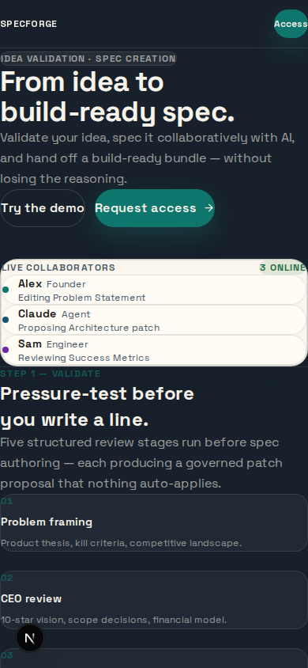
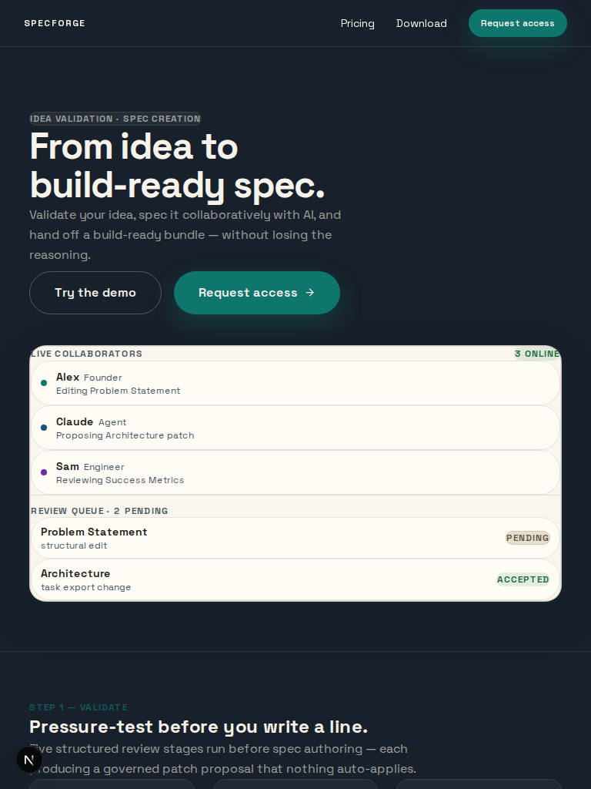
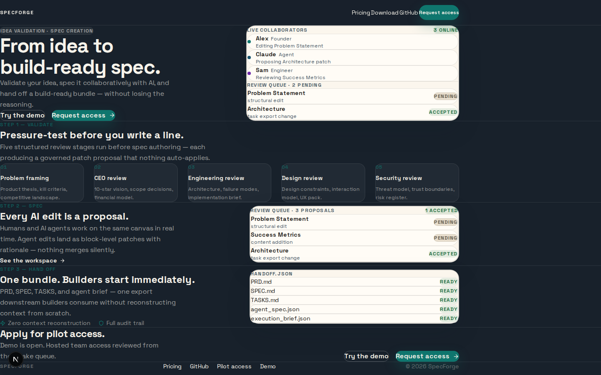

# SpecForge

**Validate the idea. Spec it with your team. Hand off to builders.**

SpecForge is an idea-validation and multiplayer spec-creation workspace. A founder, team, or AI pair can turn a raw product idea into a validated, implementation-ready spec — without losing the reasoning, tradeoffs, and review history that make the spec trustworthy.

The workflow: run a structured idea audit first (five review stages from problem framing to security), then author the spec collaboratively on a shared canvas where every AI edit lands as a reviewable patch, then export a governed handoff bundle that downstream builders can consume immediately.

Repository: https://github.com/chimera-defi/specforge

## Screenshots

| Mobile | Tablet | Desktop |
| --- | --- | --- |
|  |  |  |

## What It Does

1. **Validate** — five structured review stages (problem framing, CEO review, engineering review, design, security) before any spec authoring. Each stage produces a governed patch proposal.
2. **Spec** — multiplayer canvas where humans and AI agents co-author in real time. Agent edits land as block-level patches; humans review and merge or reject.
3. **Hand off** — export PRD, SPEC, TASKS, agent brief, and execution context as a single bundle. No context reconstruction needed.

## Demo Access

The demo workspace is open without login by default.

To gate the demo workspace with a login page for early access users, set `DEMO_PASSWORD` (and optionally `DEMO_USERNAME`, default `"demo"`) at startup:

```bash
DEMO_USERNAME=specforge \
DEMO_PASSWORD=<share-out-of-band> \
bun --filter specforge-web dev --hostname 0.0.0.0
```

Users will be redirected to `/login` and must enter the credentials before accessing `/workspace`.

For the legacy HTTP Basic Auth gate instead (browser popup), use:

```bash
SPECFORGE_DEMO_GATE_USERNAME=specforge \
SPECFORGE_DEMO_GATE_PASSWORD=<share-out-of-band> \
bun --filter specforge-web dev --hostname 0.0.0.0
```

Then expose with Cloudflare:

```bash
cloudflared tunnel --url http://127.0.0.1:3000 --no-autoupdate
```

## Pilot Intake

The pilot access form is wired to real persistence. Submissions are saved as pending records in the SpecForge store and can be reviewed from the workspace triage panel.

```bash
SPECFORGE_PILOT_TRIAGE_WORKSPACE_ID=<private-workspace-id>
SPECFORGE_PILOT_WEBHOOK_URL=<optional-notification-webhook>
```

Without a webhook, the app stores requests locally; it does not send email. The review queue in `/workspace` is the source of truth.

## Run Locally

```bash
bun install
```

Start in separate terminals:

```bash
bun run dev:web
bun run dev:collab
```

Optional: Start the local bridge for hybrid hosted + local CLI access:

```bash
bun run dev:bridge
```

Open:

- `http://localhost:3000/` — landing page
- `http://localhost:3000/workspace` — demo workspace
- `http://localhost:3000/pilot-access` — pilot request flow
- `http://localhost:4322/health` — collaboration server health check
- `http://localhost:4323/health` — local bridge health check (optional)

Local state is stored under `web/.data/` (git-ignored).

## Product Surfaces

| Surface | Purpose | Path |
| --- | --- | --- |
| Web app | Landing page, pilot intake, multiplayer workspace | `web/` |
| Collaboration server | Hocuspocus/Yjs realtime editing service | `collab-server/` |
| CLI | Terminal-native spec workflow | `cli/` |
| Desktop shell | Tauri wrapper around the local product | `desktop/` |
| Local bridge | HTTP bridge for hybrid hosted + local CLI access | `bridge/` |
| Agent skill | Agent-facing SpecForge workflow prompts | `skills/specforge/` |
| Spec pack | Product, architecture, UX, validation, and runbook docs | `spec/` |

## Documentation

- `spec/SPEC.md` — product intent and binding feature behavior
- `spec/PRD.md` — requirements and acceptance expectations
- `spec/ARCHITECTURE_DECISIONS.md` — architecture choices
- `spec/TECH_STACK.md` — stack decisions
- `spec/TASKS.md` — current backlog
- `spec/LOCAL_RUNBOOK.md` — local development and operations
- `web/DESIGN.md` — design system for the web app
- `spec/API_REFERENCE.md` — service and API endpoints

## Verification

```bash
bun run contracts:validate
bun run lint
bun run test
bun run test:acceptance
bun run build:web
```

Run `bun run test:cli` when touching `cli/`, `bun run build:desktop` when touching `desktop/`, and `bun run dev:bridge` when touching `bridge/`.
