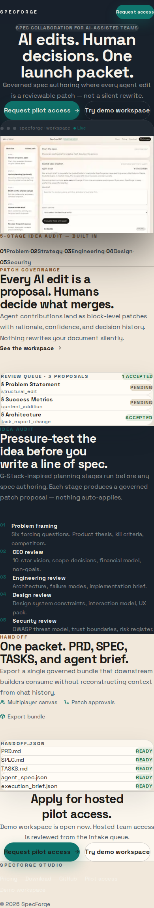
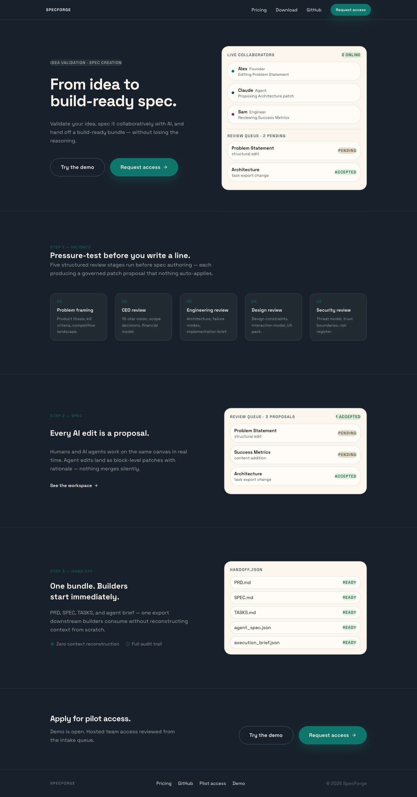
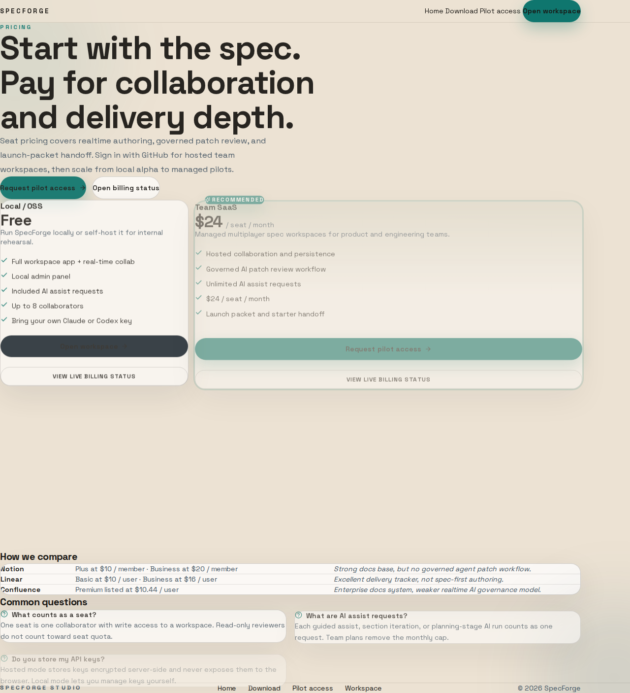

# SpecForge

> **Turn raw ideas into validated, implementation-ready specs — with full traceability.**

SpecForge is the complete workflow for product validation and spec creation. Start with structured idea validation, co-author specs in real-time with AI and teammates, then export governed handoff bundles that downstream builders can consume immediately.

**Why SpecForge?**
- **Validate before you build** — 5-stage structured review prevents wasted engineering effort
- **Never lose context** — every AI edit is a reviewable patch with full reasoning preserved
- **Ship with confidence** — governed handoff bundles include PRD, SPEC, TASKS, and execution context
- **Multiplayer by default** — real-time collaboration with humans and AI agents

**Repository:** https://github.com/chimera-defi/specforge

## What It Does

1. **Validate** — five structured review stages (problem framing, CEO review, engineering review, design, security) before any spec authoring. Each stage produces a governed patch proposal.
2. **Spec** — multiplayer canvas where humans and AI agents co-author in real time. Agent edits land as block-level patches; humans review and merge or reject.
3. **Hand off** — export PRD, SPEC, TASKS, agent brief, and execution context as a single bundle. No context reconstruction needed.

## Screenshots

 |  | 

## Quick Start

```bash
bun install
bun run dev:web    # Landing page and workspace
bun run dev:collab  # Real-time collaboration server
```

Open http://localhost:3000

## Demo Access

The demo workspace is open without login by default. To gate with credentials:

```bash
DEMO_USERNAME=specforge \
DEMO_PASSWORD=<your-password> \
bun run dev:web
```

For HTTP Basic Auth (browser popup), use:

```bash
SPECFORGE_DEMO_GATE_USERNAME=specforge \
SPECFORGE_DEMO_GATE_PASSWORD=<your-password> \
bun run dev:web
```

## Product Surfaces

| Surface | Purpose | Path |
| --- | --- | --- |
| Web app | Landing, pilot intake, multiplayer workspace | `web/` |
| Collab server | Hocuspocus/Yjs realtime editing | `collab-server/` |
| CLI | Terminal-native spec workflow | `cli/` |
| Desktop | Tauri wrapper | `desktop/` |
| Bridge | Hybrid hosted + local CLI | `bridge/` |
| Skills | Agent-facing workflow prompts | `skills/specforge/` |

## Documentation

- `spec/SPEC.md` — Product intent and binding feature behavior
- `spec/PRD.md` — Requirements and acceptance expectations
- `spec/ARCHITECTURE_DECISIONS.md` — Architecture choices
- `spec/TECH_STACK.md` — Stack decisions
- `spec/TASKS.md` — Current backlog
- `spec/LOCAL_RUNBOOK.md` — Local development and operations
- `web/DESIGN.md` — Design system for the web app

## Verification

```bash
bun run contracts:validate
bun run lint
bun run test
bun run test:acceptance
bun run build:web
```

Run `bun run test:cli` when touching `cli/`, `bun run build:desktop` when touching `desktop/`.