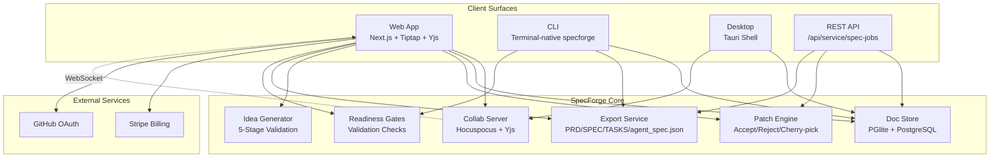
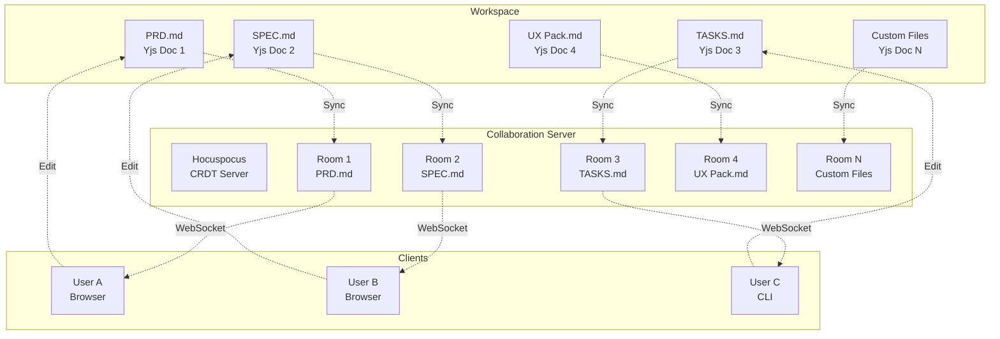

## SpecForge Architecture Diagrams

## 1) System Architecture (Mermaid)



## 2) Idea Validation to Handoff Flow (Mermaid)

```mermaid
graph LR
    subgraph "Phase 1: Idea Generation"
        IDEA[Raw Idea Input]
        IDEAS[Idea Generator<br/>5-Stage Validation]
    end
    
    subgraph "Phase 2: Validation Stages"
        D1[Demand Reality]
        D2[Status Quo]
        D3[Desperate Specificity]
        D4[Narrowest Wedge]
        D5[Observation]
        D6[Future Fit]
    end
    
    subgraph "Phase 3: Spec Creation"
        GUIDED[Guided Spec Builder]
        MULTI[Multi-File Workspace<br/>PRD/SPEC/TASKS]
        COLLAB[Real-time Collaboration<br/>Yjs + Hocuspocus]
    end
    
    subgraph "Phase 4: Review & Governance"
        PATCH[Agent Patch Proposals]
        REVIEW[Human Review Queue<br/>Accept/Reject/Cherry-pick]
        READY[Readiness Gates]
    end
    
    subgraph "Phase 5: Handoff"
        EXPORT[Export Bundle<br/>PRD/SPEC/TASKS/agent_spec.json]
        METADATA[Document Metadata<br/>Complete Traceability]
        HANDOFF[Handoff Response<br/>Planning Session Data]
    end
    
    IDEA --> IDEAS
    IDEAS --> D1
    D1 --> D2
    D2 --> D3
    D3 --> D4
    D4 --> D5
    D5 --> D6
    D6 --> GUIDED
    GUIDED --> MULTI
    MULTI --> COLLAB
    COLLAB --> PATCH
    PATCH --> REVIEW
    REVIEW --> READY
    READY --> EXPORT
    EXPORT --> METADATA
    METADATA --> HANDOFF
```



## 3) Multi-File Workspace Collaboration (Mermaid)



## 4) Human + Agent Collaboration Flow

```text
Human edits doc
   +
Agent proposes patches
   -> Review queue (accept/reject/cherry-pick)
      -> Canonical doc update
         -> Version snapshot + audit event
            -> Depth-gate / recap checks
```

## 5) Product Pipeline

```text
Idea Generation (5-stage validation)
   -> Guided Spec Creation
      -> Multi-File Workspace Collaboration
         -> Patch Review & Governance
            -> Readiness Gates
               -> Export Bundle (PRD/SPEC/TASKS/agent_spec.json)
                  -> Handoff with Metadata & Planning Session
```

## 6) MVP Component Map

```text
|[Web Editor UI]
    |      \ 
    |       -> [Agent Panel]
    v
|[Collab Sync Service (CRDT)]
    |
|[Doc API + Canonical State Store]
    |
|[Patch Engine + Policy Guardrails + Depth Gates]
    |
|[Export Service -> PRD/SPEC/TASKS/agent_spec.json]
    |
|[Idea Validation Sessions -> 5 Stages]
```

## 7) Multi-Surface Architecture

```text
                        ┌─────────────────────────┐
                        │      SpecForge Core       │
                        │  Doc Store · Patch Engine │
                        │  Export · Readiness · DB  │
                        │  Idea Validation · Meta  │
                        └──────────┬────────────────┘
                                   │
              ┌────────────────────┼──────────────────────┐
              │                    │                       │
    ┌─────────▼──────┐   ┌────────▼────────┐   ┌────────▼────────────┐
    │  Browser GUI   │   │   Terminal CLI  │   │   REST Service API  │
    │  /workspace    │   │  specforge init │   │  /api/service/      │
    │  (Tiptap+Yjs)  │   │  specforge tui  │   │    spec-jobs        │
    └────────────────┘   └─────────────────┘   └────────┬────────────┘
                                                         │
                                          ┌──────────────┴─────────────┐
                                          │                             │
                                 ┌────────▼───────┐         ┌──────────▼──────┐
                                 │  BYOA (mode:   │         │  Autonomous      │
                                 │  "assisted")   │         │  (mode: "auto-  │
                                 │  Your agent    │         │  nomous")        │
                                 │  reviews       │         │  SpecForge runs  │
                                 │  patches       │         │  full loop       │
                                 └────────────────┘         └─────────────────┘
```

## 8) Data Flow: Idea to Handoff

```text
IdeaScaffold
   ↓ (metadata: runtime_topology, distribution_model, etc.)
GuidedSpecInput
   ↓ (toSection with fallbacks)
Document Record (metadata preserved)
   ↓ (multi-file workspace)
Collaborative Editing (Yjs + Hocuspocus)
   ↓ (patch proposals)
Review & Governance (accept/reject/cherry-pick)
   ↓ (readiness checks)
Export Bundle (PRD, SPEC, TASKS, agent_spec.json)
   ↓ (includes metadata in agent_spec.json)
Handoff Response
   ├─ exportBundle (with metadata)
   ├─ planningSession (stage provenance)
   ├─ ideaValidationOutputs (completed stages)
   └─ documentMetadata (explicit field for traceability)
```

## 9) Security & Access Control

```text
GitHub OAuth
   -> JWT Token
      -> Workspace Membership (owner/editor/viewer)
         -> Document Access Control
            -> API Endpoint Authorization
               -> CSP Headers
                  -> Input Sanitization
```

## 10) Deployment Architecture

```text
Production Environment:
- Web App: Next.js 16.2.0 (Turbopack)
- Collab Server: Hocuspocus + Yjs
- Database: PostgreSQL (hosted) / PGlite (local)
- Billing: Stripe Integration
- Authentication: GitHub OAuth

Local Development:
- Web App: bun run dev:web (localhost:3000)
- Collab Server: bun run dev:collab (localhost:4322)
- Bridge: bun run dev:bridge (localhost:4323)
- State: web/.data/ (git-ignored)
```

## 11) Export Artifacts

```text
Export Bundle Contents:
- README.md (project overview)
- EXECUTIVE_SUMMARY.md (one-page summary)
- PRD.md (product requirements)
- SPEC.md (technical specification)
- TASKS.md (implementation tasks)
- AGENT_HANDOFF.md (sub-agent execution pack)
- FIRST_60_MINUTES.md (local runbook)
- RISK_REGISTER.md (risk table)
- ACCEPTANCE_TEST_MATRIX.md (test cases)
- DECISIONS.md (recorded decisions)
- USER_FLOWS.md (actor flows)
- VALIDATION_PLAN.md (signal checkpoints)
- COMPETITIVE_ANALYSIS.md (competitive landscape)
- BUSINESS_MODEL.md (business model)
- agent_spec.json (machine-readable spec with metadata)
```